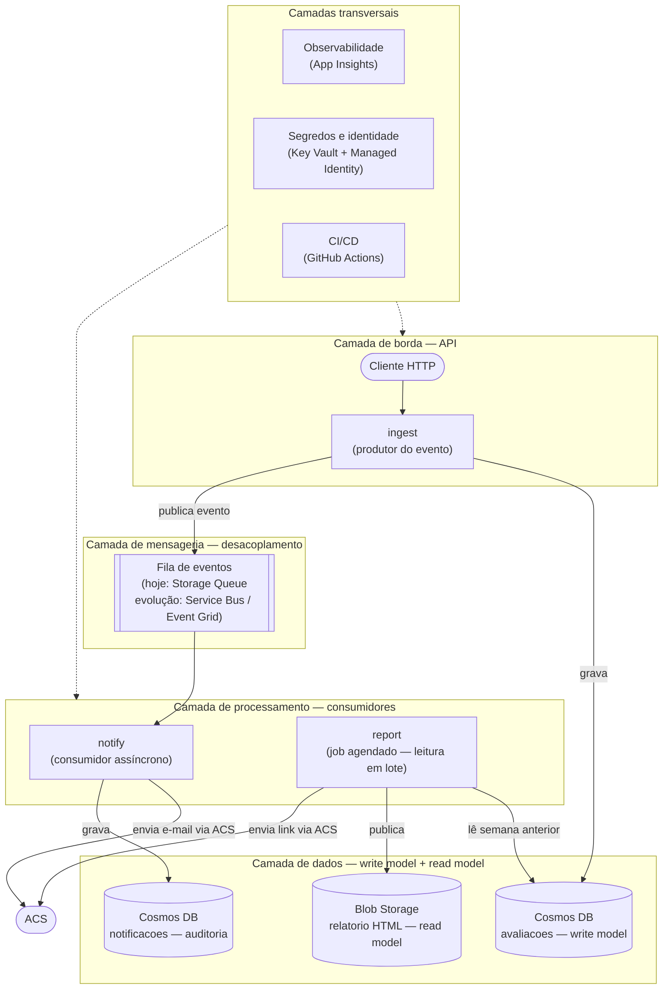

# avalie-me

> 📂 Repositório: [https://github.com/evandrosxavier/avalie-me](https://github.com/evandrosxavier/avalie-me)

Plataforma serverless de feedback de cursos, desenvolvida como Tech Challenge da Fase 4 (ADJT) da pós-graduação FIAP. Alunos avaliam aulas; administradores recebem uma **notificação imediata por e-mail** para avaliações críticas e um **relatório semanal** consolidado com link público.

📄 Justificativa detalhada de cada decisão técnica e arquitetural: [`docs/decisoes.md`](docs/decisoes.md)
📄 Especificação OpenAPI do `ingest`: [`docs/openapi.yaml`](docs/openapi.yaml)

---

## Arquitetura

```
┌─────────────────────────────────────────────────────────────────────┐
│                        CLIENTE (HTTP)                               │
│                   POST /api/avaliacao                               │
└──────────────────────────┬──────────────────────────────────────────┘
                           │
                           ▼
┌─────────────────────────────────────────────────────────────────────┐
│                     ingest  (HttpTrigger)                           │
│  • Valida entrada (estrutura) e domínio (regra de negócio)          │
│  • Deriva urgência: ALTA (0–3) / MEDIA (4–6) / BAIXA (7–10)        │
│  • Persiste avaliação no Cosmos DB                                  │
│  • Se ALTA → publica mensagem na Storage Queue                      │
│  • Erros em application/problem+json (RFC 9457)                     │
└─────────┬───────────────────────────┬───────────────────────────────┘
          │                           │
          ▼                           ▼
┌──────────────────┐     ┌────────────────────────────────────────────┐
│   Cosmos DB      │     │        Storage Queue                       │
│  (avaliacoes)    │     │      (avaliacoes-urgentes)                 │
└──────────────────┘     └──────────────────┬───────────────────────┘
                                            │
                                            ▼
                         ┌────────────────────────────────────────────┐
                         │        notify  (QueueTrigger)              │
                         │  • Lê mensagem da fila                     │
                         │  • Envia e-mail via ACS                    │
                         │  • Grava Notificacao no Cosmos DB          │
                         │    (snapshot de auditoria: ENVIADO/FALHA)  │
                         │  • Falha → relança exceção → retry nativo  │
                         │    (5 tentativas) → poison queue           │
                         └────────────────┬───────────────────────────┘
                                          │
                              ┌───────────┴──────────┐
                              ▼                      ▼
                    ┌──────────────────┐   ┌──────────────────┐
                    │   ACS (e-mail)   │   │   Cosmos DB      │
                    │  (notificação    │   │  (notificacoes)  │
                    │   ao admin)      │   └──────────────────┘
                    └──────────────────┘

┌─────────────────────────────────────────────────────────────────────┐
│         report  (TimerTrigger — semanal, segunda 8h BRT)            │
│  • Busca avaliações da semana anterior (seg a dom) no Cosmos DB     │
│  • Gera relatório HTML (layout moderno: cartões, gráfico de barras, │
│    tabela com nota + urgência, legenda de faixas)                   │
│  • Publica HTML no Blob Storage (link público)                      │
│  • Envia link por e-mail via ACS                                    │
└─────────┬───────────────────────────┬───────────────────────────────┘
          │                           │
          ▼                           ▼
┌──────────────────┐     ┌────────────────────────────────────────────┐
│   Cosmos DB      │     │   Blob Storage                             │
│  (avaliacoes)    │     │  (relatorios/relatorio-YYYY-MM-DD.html)    │
└──────────────────┘     └────────────────────────────────────────────┘

                    ┌──────────────────────────────┐
                    │   Application Insights        │
                    │  (telemetria das 3 funções)   │
                    └──────────────────────────────┘

                    ┌──────────────────────────────┐
                    │   Key Vault + Managed Identity│
                    │  (segredos de Cosmos e ACS)   │
                    └──────────────────────────────┘

                    ┌──────────────────────────────┐
                    │   GitHub Actions              │
                    │  (deploy automatizado via     │
                    │   service principal)          │
                    └──────────────────────────────┘
```

### Visão alternativa — padrão de mercado (Event-Driven Architecture em camadas)

O diagrama acima descreve o sistema em termos de fluxo. Esta segunda versão desenha a arquitetura como o mercado costuma representá-la — em **camadas horizontais** (Edge → Mensageria → Processamento → Dados), o formato usado em referências como o Azure Architecture Center para os padrões **Queue-Based Load Leveling**, **Competing Consumers** e **CQRS** que este projeto já aplica:



**Por que esse é considerado "padrão de mercado":** o `ingest` nunca chama o `notify` diretamente — ele publica um evento e segue (**Queue-Based Load Leveling**), o `notify` drena a fila de forma assíncrona e resiliente (**Competing Consumers**, com retry nativo e poison queue), e o `report` mantém um modelo de leitura (HTML agregado) separado do modelo de escrita (**CQRS** leve). A única diferença real para uma arquitetura enterprise de referência seria trocar a Storage Queue por **Service Bus** ou **Event Grid** quando surgir a necessidade de múltiplos assinantes para o mesmo evento (hoje há um único consumidor, então a fila simples é suficiente).

---

## Modelo de nuvem

**FaaS — Functions as a Service** na **Microsoft Azure**, plano **Consumption** (serverless puro: sem servidor dedicado, cobra-se apenas pelo tempo de execução). As três funções compartilham o mesmo **Function App** (`func-avalieme-dev`) na região **West Central US** — escolhida por disponibilidade de cota do SKU `Y1` na assinatura. Justificativa completa em [`docs/decisoes.md`](docs/decisoes.md#1-modelo-de-nuvem-faas-functions-as-a-service).

---

## Recursos Azure

| Recurso | Nome | Finalidade |
|---|---|---|
| Function App | `func-avalieme-dev` | hospeda as três funções |
| Cosmos DB | `cosmos-avalieme-dev` | persistência de avaliações e notificações (NoSQL, serverless) |
| Communication Service | `acs-avalieme-dev` | envio de e-mails |
| Email Communication Service | `acs-email-avalieme-dev` | domínio remetente |
| Storage Account | `funcavaliemedev65741` | fila de mensagens + blobs de relatório |
| Application Insights | `appi-avalieme-dev` | monitoramento e telemetria |
| App Service Plan | `asp-avalieme-dev` | plano Consumption |
| Key Vault | `kv-avalieme-dev` | segredos (`COSMOS_CONNECTION_STRING`, `ACS_CONNECTION_STRING`) |

---

## Funções

Três funções, cada uma com responsabilidade única: **ingest** (recebimento), **notify** (notificação) e **report** (relatório) — atendendo à regra de separação de responsabilidades do desafio.

### `ingest` — HttpTrigger
**Trigger:** `POST /api/avaliacao`

Recebe o feedback do aluno, valida em duas camadas (entrada estrutural + regra de domínio), deriva a urgência e persiste no Cosmos DB. Se a urgência for ALTA, publica uma mensagem na fila para notificação assíncrona.

**Request:**
```json
{
  "descricao": "string (mínimo 15 caracteres)",
  "nota": 0
}
```

**Response de sucesso (`201 Created`):**
```json
{
  "id": "uuid",
  "descricao": "string",
  "nota": 0,
  "urgencia": "ALTA | MEDIA | BAIXA",
  "dataRegistro": "2026-07-25T11:00:00Z"
}
```

**Regras de urgência:**
| Nota | Urgência |
|---|---|
| 0 – 3 | ALTA |
| 4 – 6 | MEDIA |
| 7 – 10 | BAIXA |

**Responses de erro** — formato `application/problem+json` ([RFC 9457](https://www.rfc-editor.org/rfc/rfc9457)), com `type` indicando a categoria (`validacao-entrada`, `regra-negocio`, `erro-interno`):

| Status | Quando |
|---|---|
| `400 Bad Request` | payload estruturalmente inválido (JSON malformado, campo ausente/tipo errado) ou violação de regra de negócio (nota fora de 0–10, descrição curta) |
| `500 Internal Server Error` | falha inesperada (ex.: indisponibilidade do Cosmos DB) — capturada por catch-all, nunca vaza sem tratamento |

Quando há mais de um problema de validação, todos são reportados de uma vez: o `detail` traz o resumo e o campo `errors` lista cada erro individualmente (o campo é omitido quando não há lista, ex.: corpo ausente ou JSON malformado).

```json
{
  "type": "https://github.com/evandrosxavier/avalie-me/erros/validacao-entrada",
  "title": "Erro de Validação",
  "status": 400,
  "detail": "Requisição inválida: nota é obrigatória; descricao é obrigatória",
  "instance": "/avaliacao",
  "errors": ["nota é obrigatória", "descricao é obrigatória"]
}
```

Especificação completa: [`docs/openapi.yaml`](docs/openapi.yaml).

---

### `notify` — QueueTrigger
**Trigger:** mensagem na fila `avaliacoes-urgentes`

Acordada automaticamente quando o `ingest` publica uma avaliação urgente. Envia e-mail ao administrador via ACS e grava um snapshot de auditoria (`Notificacao`) no Cosmos DB com status `ENVIADO` ou `FALHA`.

**Dados do e-mail de aviso:** descrição, urgência, data de envio.

**Campos do snapshot de auditoria:**
`avaliacaoId` · `descricao` · `nota` · `urgencia` · `dataRegistroAvaliacao` · `dataEnvio` · `status`

**Reprocessamento:** se o envio de e-mail falhar, a `Notificacao` é gravada com status `FALHA` e a exceção é relançada, acionando o **retry nativo do Azure Functions** (5 tentativas). Se todas falharem, a mensagem vai para a fila `avaliacoes-urgentes-poison` para inspeção manual.

---

### `report` — TimerTrigger
**Trigger:** semanalmente, toda segunda-feira às 8h (horário de Brasília)
**Cron:** `0 0 11 * * MON` (UTC)

Busca as avaliações da **semana civil anterior fechada** — de segunda-feira 00:00 a domingo 23:59:59 no fuso de São Paulo, sem incluir o dia da execução — no Cosmos DB, gera um relatório em HTML com layout moderno e publica no Blob Storage com acesso público. Envia o link por e-mail ao administrador.

**Conteúdo do relatório:**
- **Cabeçalho** com o período coberto (segunda a domingo da semana anterior)
- **Cartões de resumo:** total de avaliações, média das notas, contagem por urgência
- **Gráfico de barras** — avaliações por dia
- **Tabela de avaliações recebidas:** descrição, nota, urgência (badge colorido) e data
- **Legenda** com os intervalos de nota que definem cada urgência

**URL do relatório:** o nome do arquivo usa a data do **domingo que fecha a semana coberta**.
```
https://funcavaliemedev65741.blob.core.windows.net/relatorios/relatorio-YYYY-MM-DD.html
```

Relatório mais recente (semana de 20/07 a 26/07 de 2026):
```
https://funcavaliemedev65741.blob.core.windows.net/relatorios/relatorio-2026-07-26.html
```

---

## Testes

**36 testes automatizados** (JUnit 5 + Mockito), cobrindo validação de entrada, regra de negócio, derivação de urgência, janela do relatório semanal, geração do relatório e o fluxo de notificação (sucesso e falha com retry):

| Classe | Testes | Cobre |
|---|---|---|
| `AvaliacaoServiceTest` | 9 | validação, persistência, derivação de urgência |
| `IngestFunctionTest` | 12 | validação estrutural, regra de negócio, sucesso, catch-all de 500 |
| `NotifyFunctionTest` | 2 | envio de e-mail (sucesso) e falha com retry |
| `RelatorioServiceTest` | 8 | média, contagens, layout do relatório |
| `JanelaSemanalTest` | 5 | semana anterior fechada, limites em BRT, execução fora da segunda |

```bash
mvn test
```

**Collection Postman** com requisições prontas contra o `ingest` (sucesso, erros estruturais e de regra de negócio), com scripts `pm.test` validando status e formato de corpo:

📥 [avalie-me_postman_collection.json](avalie-me_postman_collection.json)

**Como importar:**
1. Abra o Postman → **Import** → selecione `avalie-me_postman_collection.json`
2. Importe também os environments `avalie-me_postman_environment_local.json` e `avalie-me_postman_environment_dev.json`
3. Selecione o environment desejado (`avalie-me - local` ou `avalie-me - dev`) e rode as requisições

---

## Instruções de deploy

### Pré-requisitos
- Java 21
- Maven 3.8+
- Azure CLI autenticado (`az login`)
- Conta Azure com cota disponível para plano Consumption em West Central US

### Variáveis de ambiente do Function App

| Variável | Origem | Descrição |
|---|---|---|
| `COSMOS_CONNECTION_STRING` | Key Vault (`kv-avalieme-dev`) | Connection string do Cosmos DB |
| `ACS_CONNECTION_STRING` | Key Vault (`kv-avalieme-dev`) | Connection string do Azure Communication Services |
| `EMAIL_ADMIN` | variável direta | E-mail do destinatário dos alertas e relatórios |
| `AzureWebJobsStorage` | variável direta | Connection string da Storage Account (fila + blob) |
| `APPLICATIONINSIGHTS_CONNECTION_STRING` | variável direta | Connection string do Application Insights |

### Deploy manual
```bash
mvn clean package azure-functions:deploy
```
> ⚠️ O goal `azure-functions:deploy` sozinho **não recompila** — sempre usar `clean package` antes, senão o deploy publica um jar desatualizado.

### Deploy automatizado
O repositório possui um workflow GitHub Actions (`.github/workflows/deploy.yml`) com disparo manual (`workflow_dispatch`). Autenticação via service principal armazenado como secret `AZURE_CREDENTIALS` no repositório.

```bash
# No portal GitHub: Actions → Deploy para Azure → Run workflow
```

---

## Monitoramento

O **Application Insights** (`appi-avalieme-dev`, região Central US) coleta automaticamente a telemetria das três funções via variável `APPLICATIONINSIGHTS_CONNECTION_STRING` — nenhuma mudança de código necessária.

Todas as funções emitem logs estruturados via `context.getLogger()`, visíveis em:
- **Portal Azure** → Application Insights → Logs → `traces`
- **Portal Azure** → Function App → Functions → `[nome]` → Monitor

**Consulta útil no Log Analytics:**
```kusto
traces
| where timestamp > ago(1h)
| order by timestamp desc
```

---

## Segurança e governança de acesso

- **Segredos no Key Vault (`kv-avalieme-dev`):** `COSMOS_CONNECTION_STRING` e `ACS_CONNECTION_STRING` não ficam em variável de ambiente em texto puro — são referenciados via `@Microsoft.KeyVault(...)` e resolvidos em runtime.
- **Managed Identity (system-assigned):** o `func-avalieme-dev` acessa o Key Vault via identidade gerenciada pelo Azure AD, sem credencial fixa armazenada em lugar nenhum — a política de acesso concede apenas permissão de leitura de segredo (governança de menor privilégio).
- **Rotação de chave:** a chave do Cosmos DB foi regenerada após a migração para o Key Vault; a `AccountKey` da Storage também foi renovada quando exposta acidentalmente em sessão de terminal.
- **CI/CD** usa **service principal** escopado ao resource group com menor privilégio.
- **Blob Storage** com acesso público restrito ao container `relatorios` — os demais containers (fila, dados internos) permanecem privados.
- **Erros estruturados:** respostas de erro do `ingest` seguem RFC 9457 (`application/problem+json`), sem vazar stack trace ou detalhes internos ao cliente.

Justificativa detalhada de cada decisão de segurança: [`docs/decisoes.md`](docs/decisoes.md).

---

## Estrutura do projeto

```
src/main/java/br/com/fiap/avalieme/
├── domain/
│   ├── Avaliacao.java          # record imutável da avaliação
│   ├── Notificacao.java        # record imutável do snapshot de auditoria
│   ├── StatusNotificacao.java  # enum ENVIADO | FALHA
│   └── Urgencia.java           # enum ALTA | MEDIA | BAIXA
├── dto/
│   ├── AvaliacaoRequest.java         # entrada do ingest
│   ├── AvaliacaoResponse.java        # saída 201 do ingest
│   ├── AvaliacaoUrgenteMensagem.java # mensagem da fila (bilhete gordo)
│   └── ErroResponse.java             # erro RFC 9457 (application/problem+json)
├── email/
│   ├── EmailSender.java        # interface
│   └── AcsEmailSender.java     # impl via Azure Communication Services
├── functions/
│   ├── IngestFunction.java    # HttpTrigger
│   ├── NotifyFunction.java    # QueueTrigger
│   └── ReportFunction.java    # TimerTrigger
├── repository/
│   ├── AvaliacaoRepository.java          # interface
│   ├── CosmosAvaliacaoRepository.java    # impl Cosmos DB
│   ├── InMemoryAvaliacaoRepository.java  # impl para testes
│   ├── NotificacaoRepository.java        # interface
│   ├── CosmosNotificacaoRepository.java  # impl Cosmos DB
│   └── BlobRelatorioRepository.java      # upload HTML + URL pública
├── service/
│   ├── AvaliacaoService.java   # validação e derivação de urgência
│   ├── RelatorioService.java   # geração do HTML do relatório
│   └── ValidacaoException.java # agrupa todos os erros de validação
└── util/
    ├── ConversorData.java      # conversão Instant ↔ String ISO-8601
    └── JanelaSemanal.java      # semana civil fechada (segunda a domingo)

docs/
├── decisoes.md   # decisões de arquitetura, com justificativa
└── openapi.yaml  # especificação OpenAPI 3.0.3 do ingest

avalie-me_postman_collection.json          # collection de testes manuais (Postman)
avalie-me_postman_environment_local.json   # environment local
avalie-me_postman_environment_dev.json     # environment dev (func-avalieme-dev)
```
